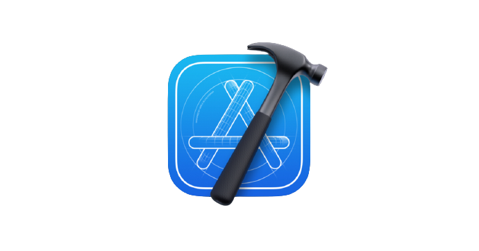
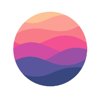

### hey there, I'm Nadia 

 
<!-- START: HERO IMAGE GIF ////////// ////////// ////////// -->

<!-- END: HERO IMAGE GIF ////////// ////////// ////////// -->
<!-- START: NADIA ICON -->
<!-- END: Nadia ICON -->

<h1 align="center"><a href="https://github.com/nadiaahmadian96">Nadia Ahmadian🛸</a></h1>

<!-- START:VISITOR COUNTER -->

<!-- END:VISITOR COUNTER -->

<!-- START: SOCIAL LINKS  -->

 

<!-- END: SOCIAL LINKS  -->

<!-- START: ABOUT ME  -->

<h3>About Me</h3>
My name is Nadia Ahmadian You can call me Nad! I am currently an 25 y/o software engineering graduate and an iOS developer   I'm a crazy gemini who believes in magic, aliens and impossible dreams and also loves to code.   among all other things in the universe I find creating the most satisfying thing to do as a job and also as a hobby so here I am developing apps and delivering results in alignment with companies mission.   I love to engage myself into different cool organisations, projects, and people.😎

<!-- END: ABOUT ME  -->

 
 

> Your time is limited, so don't waste it living someone else's life. Don't be trapped by dogma – which is living with the results of other people's thinking.
> -- Steve Jobs

# **languages and tools:**  

<!-- START: PROGRAMMING LANGUAGES -->

<code></code>
<code></code>
<code></code>
<code></code>
<code></code>
<code></code>
<code></code>
<code></code>
<code></code>
<code></code>
<code></code>
<code></code>
#
<!-- END: PROGRAMMING LANGUAGES -->

 
 
<!-- START: MUSIC STATUS -->

 

 

<!-- END: MUSIC STATUS -->

# 💻 Latest Blog Posts
<!-- BLOG-POST-LIST:START -->🔘Core ML https://medium.com/nerd-for-tech/core-ml-e840938a55d9?source=rss-ae64efaa0bb3------2 🔘Swift Tuples https://medium.com/nerd-for-tech/swift-tuples-e41bcf579cfd?source=rss-ae64efaa0bb3------2 🔘Swift Structs vs. Classes https://medium.com/nerd-for-tech/swift-structs-vs-classes-f2014da7a20f?source=rss-ae64efaa0bb3------2 🔘How to Bring Moon Into Your Room Using AR Kit https://towardsdev.com/how-to-bring-moon-into-your-room-using-ar-kit-81e4d7dfcfae?source=rss-ae64efaa0bb3------2 🔘Geometric Transformation in Digital Image processing https://towardsdev.com/geometric-transformation-in-digital-image-processing-4236a6553dc2?source=rss-ae64efaa0bb3------2 <!-- BLOG-POST-LIST:END -->

# 📱 Latest Tweets
<!-- TWITTER:START -->

<!-- TWITTER:END -->

 
 

 

  

<!-- START: GITHUB STATUS -->

  

  
  
# Todoist Stats

<!-- TODO-IST:START -->
🏆  50 Karma Points           
🌸  Completed 0 tasks today           
✅  Completed 7 tasks so far           
⏳  Longest streak is 1 days
<!-- TODO-IST:END -->

<!-- END: GITHUB STATUS -->
  

  
   
  
  
  Here are some [🦜 parrots](https://cultofthepartyparrot.com):

    
    
    
    
    
    
    
    
    
    
    
    
    
    
    
    
    
    
    
    
    
    
    
    

