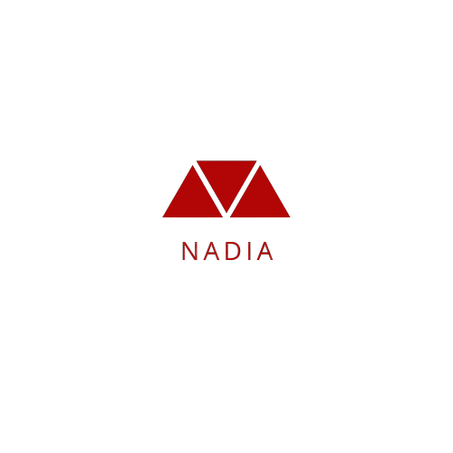

<!-- START: HERO IMAGE GIF ////////// ////////// ////////// -->

<!-- END: HERO IMAGE GIF ////////// ////////// ////////// -->
<!-- START: NADIA ICON -->

<!-- END: NELLYXINWEI ICON -->

<h1 align="center"><a href="https://github.com/nadiaahmadian96">Nadia Ahmadian🛸</a></h1>

<!-- START:VISITOR COUNTER -->

<!-- END:VISITOR COUNTER -->

<!-- START: SOCIAL LINKS  -->
     
 

<!-- END: SOCIAL LINKS  -->

<!-- START: MUSIC STATUS -->

<!-- END: MUSIC STATUS -->

<!-- START: ABOUT ME  -->

<h3>About Me</h3>
My name is Nadia Ahmadian You can call me Nad! I am currently an 25 y/o software engineering graduate and an iOS developer   I'm a crazy gemini who believes in magic, aliens and impossible dreams and also loves to code.   among all other things in the universe I find creating the most satisfying thing to do as a job and also as a hobby so here I am developing apps and delivering results in alignment with companies mission.   I love to engage myself into different cool organisations, projects, and people.😎

<!-- END: ABOUT ME  -->

<!-- START: PROGRAMMING LANGUAGES -->
       
<!-- END: PROGRAMMING LANGUAGES -->
<!-- START: GITHUB STATUS -->

 
 

  

 
 
  

<!-- END: GITHUB STATUS -->

 
<!-- START: 3RD ROW ////////// ////////// ////////// -->

  

<!-- END: 3RD ROW ////////// ////////// ////////// -->
